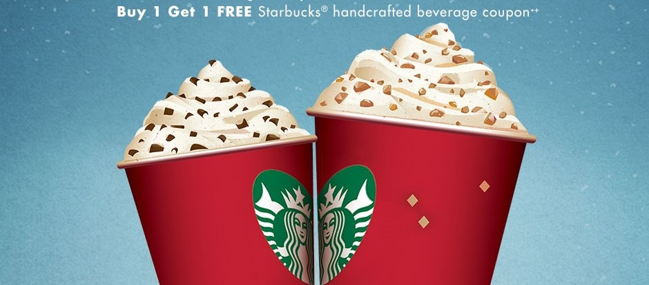

# Starbucks Offers Optimization

### Table of Contents

1. [Installation](#installation)
2. [Project Motivation](#motivation)
3. [File Descriptions](#files)
4. [Results](#results)
5. [Licensing, Authors, and Acknowledgements](#licensing)

## Installation 

Besides the Anaconda distribution of eli5, progressbar and lime libraries need to be installed.
Use below commands to install these two libraries.

`pip install eli5`

`pip install lime`

`pip install progressbar`

## Project Motivation

Promotional offers are quite prevalent these days. Almost every corporate house that sells consumer products runs some kind of promotional offers -be it due to increased competition, or to expand the customer base or to generate more revenue. Since there is a cost associated with sending these offers, it is of utmost importance to maximize the likelihood of success by devising effective promotional strategies.
In this post, we will analyze simulated promotional offers data that mimic customer behavior on the Starbucks rewards mobile app. We will use this data to derive business insights and then translate those findings into an [‘explainable’ machine learning model](https://en.wikipedia.org/wiki/Explainable_artificial_intelligence) that will predict whether or not a customer is going to respond to an offer. The objective is to send offers to only those customers who are more likely to respond and also send those offers which have the maximum chance of success with that customer.

## File Descriptions 

There is a single notebook available here to showcase work related to the above questions.

Data:
* portfolio.json : containing offer ids and meta data about each offer (duration, type, etc.)
* profile.json : demographic data for each customer
* transcript.json : records for transactions, offers received, offers viewed, and offers completed

Images: contains images used in this description file.

## Results

Reflections:
* The difficulty level and reward amount of offers along with membership duration, income, and age of customers are the most important features that determine the chances of offer success.
* Discount offers type, longer duration, lesser difficulty level are some of the offers attribute that increases probability of a successful offer.
* Some of the customers attribute that increases response probability are higher income(>60 k), longer membership(sweet spot is in 1 to 2.5 years range), female gender and higher age(>40 years).

Scope for Improvement:

* Using transaction data for predicting customer's responses would result in data leakage. However, historical data related to customers' purchase amounts can help us in predicting if a customer is going to respond to an offer or not. For instance, if a customer's average spending is much more than the regular customer, sending the low difficulty offers to them does not make much of a business sense. We would rather send the high difficulty offers to them. Also, with the current data, it is difficult to judge if informational offers had any influence. A comparison of the customer's historical average spending rate with the offer period average spending rate would have helped us determine the effect of informational offers.
* There are lots of cases where customers availed of the offer without viewing it. From a business perspective, we would ideally want to avoid sending those offers. During our analysis, we could not find attributes that can help predict this segment of customers. However, a way around would be to make the offers coupon-based. That way only the customers wanting to avail the offers would be able to complete the offers.
 * Since all offers were not sent to all the users, we can create a data set by mapping all offers to all customers and then predict customer's responses for each of the offers. If a customer is likely to respond to multiple offers, we need to pick only the ones which bring maximum business, for instance, the offers with the highest difficulty or the lowest reward ratio.

Results are discussed in detail in a [Blog post](https://medium.com/@samardolui/cdf9bcedd48a)

## Licensing, Authors, Acknowledgements

Credits to [Udacity](https://www.udacity.com/) and Starbucks for the project idea and the dataset.
